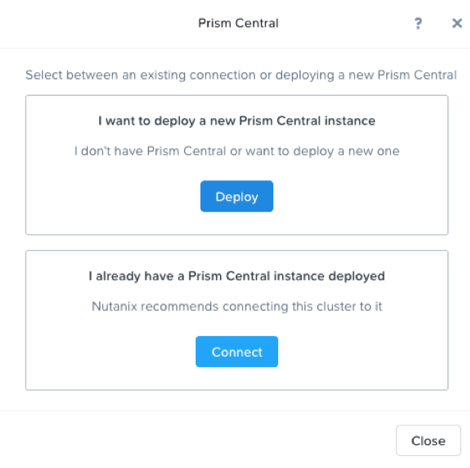
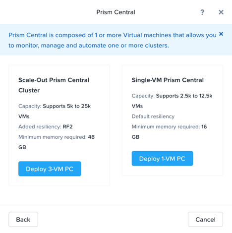
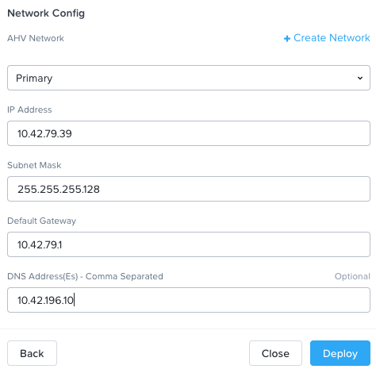

# Overview

!!!info
       Estimated time to complete: **30 Minutes**

This lab will introduce Prism Central's(PC) One-Click deploy process

## Create Primary and Secondary networks

!!!alert
        The Primary network is for PC and other VMs deployment, the Secondary network is requried in X-Ray lab

Open ``https://POCxx-ABC Cluster IP*:9440`` (https://10.42.xx.37:9440)
in your browser and log in with the following credentials:

-  **Username** - admin
-  **Password** - check password in RX

1.  In the Prism Element UI click :fontawesome-solid-gear: > **Network Configuration > Networks > Create Network**

2.  Fill out the following fields:

    -  **Name** - Primary
    -  **Virtual Switch** - vs0
    -  **VLAN ID** - 0
    -  **Enable IP address management** - leave it unselected

3.  Click **Save**

4.  Create the second network by clicking on **+ Create Network** with
    the following details:

    -  **Name** - Secondary
    -  **Virtual Switch** - vs0
    -  **VLAN ID** - *HPOC Cluster ID* 1 (e.g. for **PHX-POC079**,
        VLAN ID would be **791**)
    -  **Enable IP address management** - leave it unselected

5.  Click **Save**

6.  You should see two networks as shown here

    

## Prism Central Deploy

1.  Navigate to **Home** page and click **Register or create new** in
    Prism Central widget.

    

2.  Choose the first **Deploy** option.

    

3.  Download the latest version and click **Deploy 1-VM PC**

    

4.  Fill out the following fields:

    -  **VM Name** - PC
    -  **Select A Container** - SelfServiceContainer
    -  **VM Sizing** - SMALL - (UP TO 2500 VMs)

    

5.  In Network config, fill our the following details (XX here is your POC number)

    -  **AHV Network** - Primary
    -  **IP Address** - 10.42.XX.39
    -  **Subnet Mask** - 255.255.255.128
    -  **Default Gateway** - 10.42.XX.1
    -  **DNS Address(Es)** - 10.42.196.10

    

6.  Click **Deploy**

    !!!note
           The deployment will take about 30 mins, you can go to next lab sessions while waiting. After Prism Central VM is successfully deployed, open ``https://*PC VM IP*:9440`` (https://10.42.xx.39:9440) in your browser and log in with the following credentials:

7.  When the deployment finishes, browse to your Prism Central IP
    address (e.g. 10.42.XX.39) with the following details:

    -  **Username** - admin
    -  **Password** - default with capital N
    -  change password to - check password in RX

8.  Test if you can login Prism Central with the new password

9.  Accept EULA if displayed

## Prism Central Registration

1.  Go back to POCxx-ABC Cluster (https://10.42.xx.37:9440)

1.  Navigate to **Home** page and click cluster name **POCxx-ABC** and provide a cluster data service ip **10.42.xx.38** 

    

2.  Click **Register or create new** in Prism Central widget. 

    

3.  Choose the second **Connect** option. 

    

4.  Click **Next** 

    

5.  Fill out the following fields, leave others as default and click **Connect**:

    -  **Prism Central IP** - 10.42.xx.39
    -  **Port** - 9440
    -  **Username** - admin
    -  **Password** - check password in RX
   
    

    You will see an **OK** with PC\'s IP in Prism Central widget.
   
    

You have successully registered Prism Element to be managed your Prism Central.

!!!note
       Once the Prism Element registration is complete, several management features on Prism Element will be **Read-Only** mode but fully available in Prism Central.

