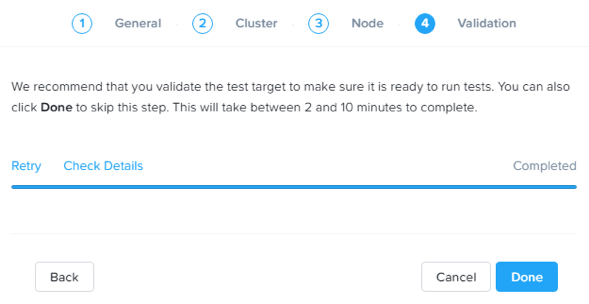
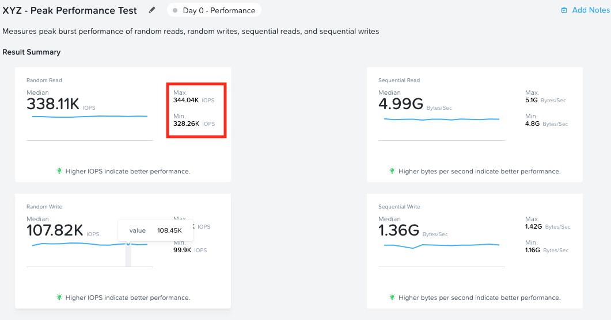
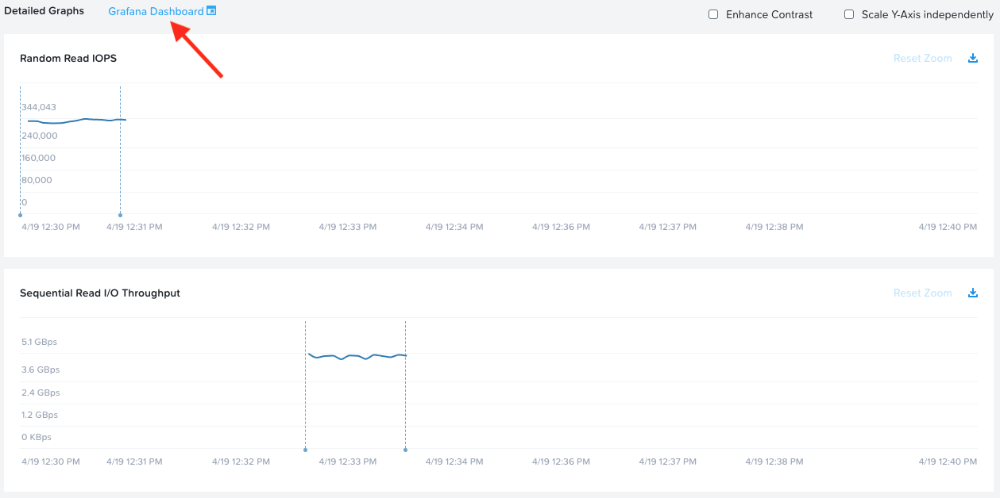
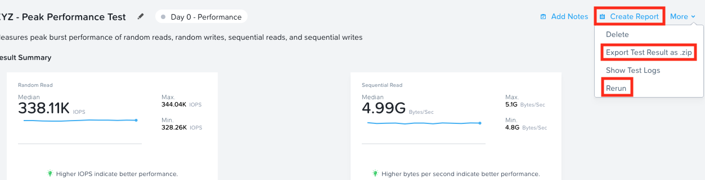
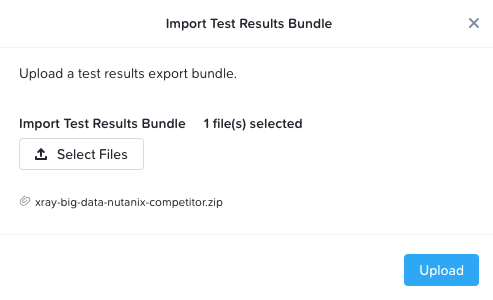
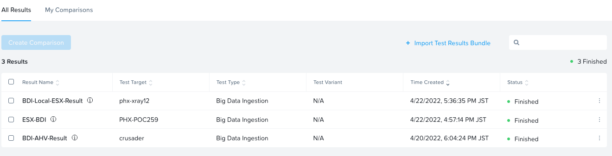
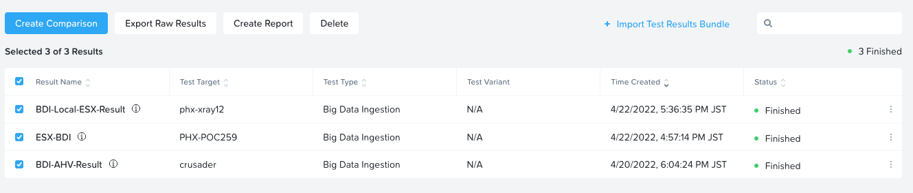

# Overview

!!!info
       Estimated time to complete: **60 Minutes**

X-Ray is an automated testing application for virtualized infrastructure solutions. It is capable of running test scenarios end-to-end to evaluate system attributes in real-world use cases. In this exercise you will deploy and configure an X-Ray VM, run X-Ray tests, and analyze results.

As X-Ray powers down hosts for tests that evaluate availability and data ntegrity, it is best practice to run the X-Ray VM outside of the target cluster. Additionally, the X-Ray VM itself creates a small amount of storage and CPU overhead that could potentially skew results.

In this lab, we will deploy X-Ray VM on POCxx-D, and evalutate cluster *POCxx-ABC* we just created.

For environments where DHCP is unavailable (or there isn't a sufficiently large pool of addresses available), X-Ray supports [Link-local](https://en.wikipedia.org/wiki/Link-local_address) or Zero Configuration networking, where the VMs communicate via self-assigned IPv4 addresses. In order to work, all of the VMs (including the X-Ray VM) need to reside on the same Layer 2 network. To use Link-local networking, your X-Ray VM's first NIC (eth0) should be on a network capable of communicating with your cluster. A second NIC (eth1) is added on a network without DHCP.
## Create the X-Ray VM image

1.  Open a terminal and SSH to Node-D CVM, enter CVM credentials and execute following commands

    ```bash title="Logon to SSH console of CVM"
    ssh -l nutanix 10.42.xx.32   #<check password in RX>
    ```

2. Upload the X-Ray Image

    ```bash
    cvm:~$ acli image.create X-Ray container=Images image_type=kDiskImage source_url=http://10.42.194.11/images/Xray/4.1.3/xray-4.1.3.qcow2
    ```
    !!!caution
          Wait until you see that the image upload is complete with a message ``X-Ray: Complete``

2.  You can confirm presence of X-Ray image by running the following command in the same shell

    ```bash
    cvm:~$ acli image.list
    ```
    ``` { .text .no-copy }
    # Output here
    Image name  Image type  Image UUID                            
    Foundation  kDiskImage  c970941a-d583-4640-8e03-9b2ca7336d00  
    X-Ray       kDiskImage  ac819fab-3fb9-4e85-99fd-97ca3f925ec8  << here is your X-Ray Image
    ```

## Configuring Networks

For targeting network, we will use the Secondary network VLAN for communication between the X-Ray VM and X-Ray worker VMs. This is accomplished via "Zero Configuration" networking, as the 3-node cluster Secondary and 1-node cluster Secondary networks are the same Layer 2 network and there is no DHCP.

Now we switch to Prism portal of single node cluster D

1.  Open ``https://<POCxx-D Cluster IP>:9440`` (https://10.42.xx.32:9440) in your browser and log in with the following credentials:
    -   **Username** - admin
    -   **Password** - *check password in RX*
2.  Then, configue the **Secondary** network on the single node cluster D
3.  Click **Create Network**. Using the Cluster Details spreadsheet, fill out the following fields and click **Save**:
    -   **Name** - Secondary
    -   **Virtual Switch** - vs0
    -   **VLAN ID** - *HPOC Cluster ID* 1 (e.g. for **PHX-POC079**, VLAN ID would be **791**)
    -   **Enable IP address management** - leave it unselected
4.  Click on **Save**
## Creating X-Ray VM

1.  In **Prism > VM > Table** and click **+ Create VM**.

1.  Fill out the following fields and click **Save**:

    -   **Name** - X-Ray
    -   **vCPU(s)** - 2
    -   **Number of Cores per vCPU** - 1
    -   **Memory** - 4 GiB
    -   Select **+ Add New Disk**
        -   **Operation** - Clone from Image Service
        -   **Image** - X-Ray
        -   Select **Add**
    -   Select **Add New NIC**
        -   **VLAN Name** - Primary
        -   Select **Add**
    -   Select **+ Add New NIC**
        -   **VLAN Name** - Secondary
        -   Select **Add**

2.  Select your **X-Ray** VM and click **Power on**.

    !!!info
           At the time of writing, X-Ray 4.1.3 is the latest available version. The URL for the latest X-Ray OVA & QCOW2 images can be downloaded from the [Nutanix Portal](https://portal.nutanix.com/#/page/static/supportTools).

3.  Once the VM has started, click **Launch Console**

4.  Make sure the VM is booting to console

5.  Your X-Ray VM would have received an IP address from the DHCP server in Primary network

6.  Determine the IP address of the NIC (eth0) on the **Primary** network of the X-Ray VM from Prism Element and note it down

!!!note
       It is critical that you select the IP address of the network adapter assigned to the **Primary** network (you can confirm by comparing the MAC address in the VM console to the MAC address shown in Prism). We will use this network to assign a static IP to the X-Ray VM to access the web interface.

       We will **NOT** assign an address to the **Secondary** network adapter. This network will be used for zero configuration communication between the X-Ray VM and client VMs. This approach is helpful when DHCP isn't available or the DHCP scope isn't large enough to support X-Ray testing.

## Configuring X-Ray

1.  Open ``https://X-RAY-VM-IP`` (<https://10.42.xx.52>) in a browser

2.  Click on Log in with Local Account

    

3.  Click on **Sign up now** in the bottom of the screen

4.  Provide the following details

    -   **Email** - <youremail@nutanix.com>
    -   **Password** - set it to cluster password

5.  Click on **Submit**

6.  Select **I have read and agree to the terms and conditions** and click **Accept**.

    

7.  Select **Targets** from the navigation bar and click **Add Target**. Fill out the following fields and click **Next**:

    -   **Name** - POCxx-ABC
    -   **Manager Type** - Prism
    -   **Cluster Type** - Nutanix
    -   **Hypervisor** - AHV
    -   **Address** - *3-Node Cluster Virtual IP* 10.42.xx.37
    -   **Username** - admin
    -   **Password** - you 3 node cluster password
    -   **Expiration Time** - leave blank

    

8.  Click **Next**

9.  Select **Secondary** under **Network** and click **Next**.

    

10. Click **Next**

11. Under **OOB Management Protocol**, choose **IPMI**

12. Review A, B and C node configurations

13. From the drop down menu, choose **Fill with Nutanix defaults**

    

14. Click **Next**

15. Click **Run Validation**.

    

16. Click **Check Details** to view validation progress.

    

17. Upon successful completion of validation, click **Done**.

    

## Running X-Ray Tests

While X-Ray offers many testing options, we will use **Peak Performance Microbenchmark** test in this lab.

1.  Select **Tests** from the navigation bar

2.  In the list of tests, find **Peak Performance Microbenchmark** and click on **View & Run Test**

    

3.  Review the test description

4.  Enter the test name as **Your Initials - Peak Perforamce Test**

5.  Confirm your **POCxx-ABC** as the right target

6.  Choose the **Default** test variant

    

7.  Click **Run test**.

    !!!caution
              X-Ray can run one test per target at a time. Many tests can be queued for a single target, allowing X-Ray to automatically run through multiple tests without requiring manual intervention. Through automation, X-Ray can drastically decrease the amount of time to conduct a POC.

8.  Click on **View Test**

9.  You are able to monitor the test progress and results in the **Results** page

10. Click on **In Progress** link to see which stage you are at in the test

    

11. You can see the random/sequential read/write tests are coming up soon

    

12. Click on **Got it** to return to the test Results page

13. As the test runs you will be able to see the test results as shown here

    Note the minimum and maximum performance numbers all in one screen.

    

14. You are also able to get detailed view of the metrics as a Grafana dashboard, click on the **Grafana Dashboard** link

    

15. Grafana dashboards presents detailed metrics view

    

16. You are also able to generate reports (in PDF), export Test Results and re-run the tests.

    

!!!tip
       The graphs are interactive, and you can click and drag to zoom into specific data/times on each individual graph. You can zoom out by clicking **Reset Zoom**.

       Each dotted blue line represents an event in the test, such as beginning a workload, powering off a node, etc. Clicking the blue dots will provide information about the event.
       
       Clicking the **Actions** drop down menu provides options to view the detailed log data, export the test results, and generate a PDF report.

## Working with X-Ray Results

As X-Ray is using automation to perform the exact same tests and collect
the same metrics on multiple systems/hypervisors, the results can be
easily overlaid to compare solutions. In this exercise you will use
X-Ray to compare BigData Ingestion test results between Nutanix and a
competitor.

The BigData Ingestion test compares the speed at which 1TB of sequential
data can be written to a single VM on a cluster, as is common in
workloads such as Splunk.

1.  Download the following exported X-Ray test result:

    [Competitor + Nutanix Big Data Ingest Results](xray-big-data-nutanix-competitor.zip)

2.  Select **Results** **> Import Test Result Bundle** from the navigation bar.

3.  Click **Choose File** and select the Nutanix test results .zip file previously downloaded.

4.  Click **Upload**.

    

5.  Once the file successfully uploads, you will see three results as shown here

    

6.  Select all 3 **BigData Ingestion** results and click **Create Comparison**.

    

The resulting charts show the combined metrics for all three solutions. You are able to see the software and hardware versions of the
infrastructure cluster where the test was conducted.

By hovering over the graph you can also see point-in-time performance metrics.

In this case we can clearly see that the Nutanix solution is able to sustain a higher, and more consistent, rate of write throughput,
resulting in a much faster time to complete ingesting the 1TB of data.


## Exporting X-Ray Results

1.  To export analysis results for use in proposal documents, etc., 

2.  Select the results you need in **All Results**page and click on
    **Create report**.

    

    The results will open and can be printed or exported as PDF.

    Here is a results file for your reference.

    [X-Ray Export Result PDF](X-Ray-Result.pdf)

2.  Multiple analyses can also be selected to generate a combined report
    with the results from multiple tests, this can be extremely useful
    for summarizing POC results.

    !!!question 
               Can you explain **why** the Nutanix solution may produce better results than common HCI competitors?

    !!!tip 
          Check out the [OpLog](https://www.nutanixbible.com/4c-book-of-aos-dsf.html#oplog) section of the Nutanix Bible
        
## Takeaways

- X-Ray is a easy to use benchmarking tool to make your life in the field easier
- X-Ray has many testing scenarios (database, big data, etc) for specific use-cases
- X-Ray is available as a VM appliance as well as SaaS (tests can be run only on Nutanix HPOC clusters)
- X-Ray testing parameters can be customised easily to suit yours or your customer's testing requierements